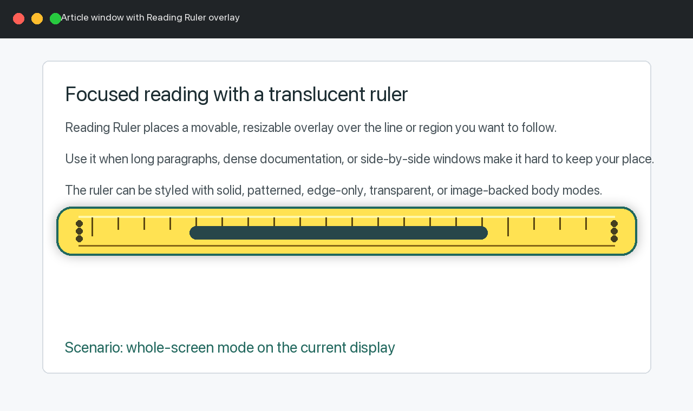
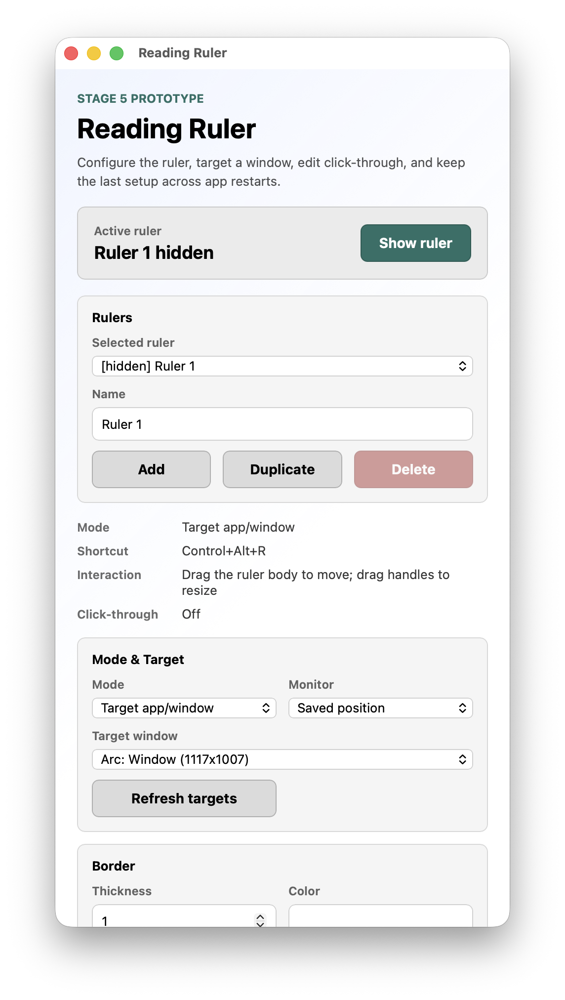
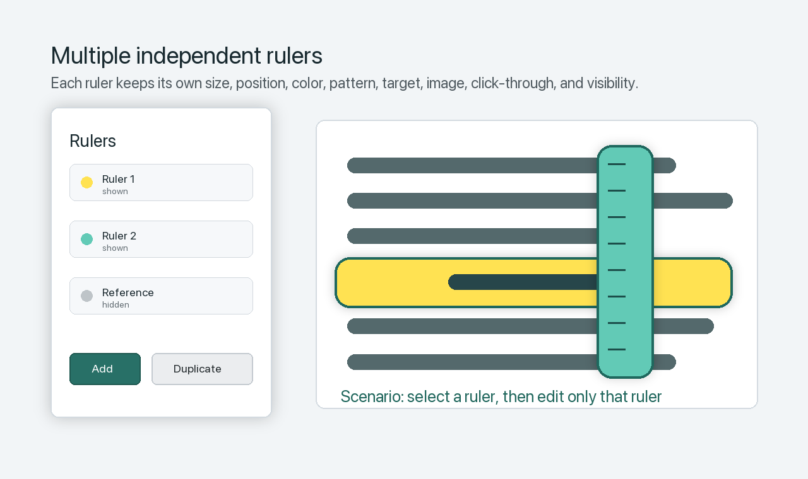

# Reading Ruler

Reading Ruler is a cross-platform desktop reading ruler overlay with multiple customizable rulers, window targeting, and macOS packaging.

It helps keep your place while reading dense text, documentation, spreadsheets, PDFs, browser pages, or side-by-side windows. Local unsigned install paths are provided for macOS Apple Silicon, macOS Intel, and Windows.



Repository: <https://github.com/bilalalissa/Reading-Ruler.git>

License: MIT

## Features

- Multiple independent rulers, each with its own geometry, style, target, image, click-through state, and visibility.
- Active-ruler controller with add, duplicate, rename, delete, select, show, and hide controls.
- Direct on-screen movement and resizing by dragging the ruler body, edges, or corners.
- Whole-screen mode for a selected/saved display position.
- Targeted app/window mode that tracks the selected exact window with saved offsets.
- Style controls for border thickness/color, background color, opacity, pattern spacing, and body mode.
- Body modes: solid, dotted, striped, grid, transparent, edge-only variants, and image background.
- Image backgrounds from imported files or clipboard paste.
- Click-through mode with a separate edit mode so the ruler can stop intercepting mouse input during reading.
- Global shortcut, default `Control+Alt+R`, for toggling the active ruler.
- macOS app menu actions for recovering the control panel and showing, hiding, toggling, or resetting the active ruler.
- Settings are persisted in the OS user config directory and restored on launch.
- Unsigned local `.app` zip/install packaging for macOS Apple Silicon, macOS Intel, and universal macOS builds.
- Unsigned Windows local installer packaging helper for NSIS or MSI builds.
- Local DMG packaging remains available for macOS testing, but DMGs are not the primary release path while Developer ID signing is unavailable.
- Developer ID distribution packaging workflow with hardened runtime, optional notarization, stapling, and checksum generation.

## Screenshots

### Control Panel

Use the control panel to choose the active ruler, edit its properties, target a window, import/paste images, configure click-through, and package the same settings across restarts.



### Whole-Screen Reading

Use whole-screen mode when you want a ruler that floats over the current display and stays where you place it.


### Multiple Rulers

Use multiple rulers when you want separate overlays for different regions, windows, monitors, colors, or reading tasks.



## Install

There are two install paths:

- **Download the ready-made Apple Silicon app zip** if you are on an M1, M2, M3, or newer Mac.
- **Build locally from the repo** for macOS Intel, universal macOS, Windows, or when you want the latest source version.

The dependency checker scripts are inside the repo. If you are building locally, get the repo first, then run the checker for your platform.

### Get The Repo First

Use this before any build-from-source install.

#### macOS

1. Open the macOS `Terminal` app.
2. Choose where you want the project folder, for example:

```sh
cd "$HOME/Downloads"
```

3. If Git is installed, clone the repo:

```sh
git clone https://github.com/bilalalissa/Reading-Ruler.git
cd Reading-Ruler
```

If Git is not installed, open <https://github.com/bilalalissa/Reading-Ruler>, choose `Code` > `Download ZIP`, unzip it, then in Terminal run `cd` into the unzipped `Reading-Ruler` folder.

#### Windows

1. Open `PowerShell`.
2. Choose where you want the project folder, for example:

```powershell
cd $HOME\Downloads
```

3. If Git is installed, clone the repo:

```powershell
git clone https://github.com/bilalalissa/Reading-Ruler.git
cd Reading-Ruler
```

If Git is not installed, open <https://github.com/bilalalissa/Reading-Ruler>, choose `Code` > `Download ZIP`, unzip it, then in PowerShell run `cd` into the unzipped `Reading-Ruler` folder.

### Install Build Dependencies

Run these commands from inside the `Reading-Ruler` repo folder.

#### macOS Apple Silicon

In Terminal:

```sh
./script/check_macos_deps.sh
```

If the script reports missing tools, let it try to install them:

```sh
./script/check_macos_deps.sh --install
```

The script checks Xcode Command Line Tools, Rust/Cargo/rustup, and Node.js/npm. It can open the Xcode Command Line Tools installer and use Homebrew for Node.js or rustup if Homebrew is installed.

#### macOS Intel Or Universal

In Terminal:

```sh
./script/check_macos_deps.sh --with-intel-target
```

If the script reports missing tools, let it try to install them:

```sh
./script/check_macos_deps.sh --install --with-intel-target
```

This checks the normal macOS dependencies plus the `x86_64-apple-darwin` Rust target needed for Intel/universal builds.

#### Windows

In PowerShell:

```powershell
powershell -ExecutionPolicy Bypass -File script/check_windows_deps.ps1
```

If the script reports missing tools, let it try to install them with `winget`:

```powershell
powershell -ExecutionPolicy Bypass -File script/check_windows_deps.ps1 -Install
```

The script checks Rust/Cargo/rustup with the MSVC toolchain, Node.js/npm, Visual Studio Build Tools with MSVC, and Microsoft WebView2 Runtime.

If automatic install is not available, install missing dependencies manually:

- Rust/Cargo: <https://rustup.rs/>
- Node.js/npm: <https://nodejs.org/>
- Xcode Command Line Tools: run `xcode-select --install` in macOS Terminal.
- Visual Studio Build Tools: <https://visualstudio.microsoft.com/visual-cpp-build-tools/>
- Microsoft WebView2 Runtime: <https://developer.microsoft.com/microsoft-edge/webview2/>

### macOS Apple Silicon Install

Use this on M1, M2, M3, or newer Apple Silicon Macs.

Download from the GitHub release:

- [Reading.Ruler_0.1.0_aarch64.app.zip](https://github.com/bilalalissa/Reading-Ruler/releases/download/v0.1.0/Reading.Ruler_0.1.0_aarch64.app.zip)

Install from the downloaded file:

1. Unzip `Reading.Ruler_0.1.0_aarch64.app.zip`.
2. Move `Reading Ruler.app` to `Applications` or `~/Applications`.
3. Open `Reading Ruler.app`.
4. If macOS blocks the unsigned app, Control-click the app, choose `Open`, then confirm. For local testing you can also remove quarantine:

```sh
xattr -dr com.apple.quarantine "$HOME/Applications/Reading Ruler.app"
```

Build locally instead:

1. Get the repo using the macOS steps above.
2. In Terminal, install/check dependencies:

```sh
./script/check_macos_deps.sh
```

3. If anything is missing, let the script try to install it:

```sh
./script/check_macos_deps.sh --install
```

4. Install project dependencies:

```sh
npm install
```

5. Build and install:

```sh
npm run app:package:mac:local -- --target arm64 --install
```

6. Open the app:

```sh
open "$HOME/Applications/Reading Ruler.app"
```

### macOS Intel Install

Use this on Intel Macs.

No Intel release download is published yet. Build the Intel local app from the repo:

1. Get the repo using the macOS steps above.
2. In Terminal, install/check dependencies and the Intel Rust target:

```sh
./script/check_macos_deps.sh --with-intel-target
```

3. If anything is missing, let the script try to install it:

```sh
./script/check_macos_deps.sh --install --with-intel-target
```

4. Install project dependencies:

```sh
npm install
```

5. Build and install:

```sh
npm run app:package:mac:local -- --target x64 --install
```

6. Open the app:

```sh
open "$HOME/Applications/Reading Ruler.app"
```

### Universal macOS Install

Use this when one local app bundle should run on both Apple Silicon and Intel Macs.

No universal macOS release download is published yet. Build the universal local app from the repo:

1. Get the repo using the macOS steps above.
2. In Terminal, install/check dependencies and the Intel Rust target:

```sh
./script/check_macos_deps.sh --with-intel-target
```

3. If anything is missing, let the script try to install it:

```sh
./script/check_macos_deps.sh --install --with-intel-target
```

4. Install project dependencies:

```sh
npm install
```

5. Build and install:

```sh
npm run app:package:mac:local -- --target universal --install
```

6. Open the app:

```sh
open "$HOME/Applications/Reading Ruler.app"
```

The local macOS install command copies `Reading Ruler.app` to `~/Applications`, creates a shareable `.app.zip`, writes a SHA-256 checksum, and removes quarantine from the local copy when possible.

### Windows Install

Use this on Windows for a local unsigned installer.

No Windows release download is published yet. Build the Windows local installer from the repo:

1. Get the repo using the Windows steps above.
2. In PowerShell, install/check dependencies:

```powershell
powershell -ExecutionPolicy Bypass -File script/check_windows_deps.ps1
```

3. If anything is missing, let the script try to install it with `winget`:

```powershell
powershell -ExecutionPolicy Bypass -File script/check_windows_deps.ps1 -Install
```

4. Install project dependencies:

```powershell
npm install
```

5. Build the default NSIS installer:

```powershell
npm run app:package:windows:local
```

6. Run the generated installer from:

```text
src-tauri\target\release\bundle\
```

7. If Windows SmartScreen warns that the installer is unsigned, choose the local/internal install option to continue.

To build MSI instead:

```powershell
npm run app:package:windows:local -- -Bundle msi
```

The script writes a SHA-256 checksum file next to the generated installer.

### Local macOS DMG

DMGs are local-only for now. Use this only when you specifically need a local DMG test artifact:

```sh
npm run app:package:mac
```

Expected local artifacts:

- `src-tauri/target/release/bundle/macos/Reading Ruler.app`
- `src-tauri/target/release/bundle/dmg/*.dmg`

The packaging script validates the generated app bundle, reports executable architecture, checks code-signing status, and verifies generated DMGs. Keep DMGs local while Developer ID signing is unavailable.

### Signed macOS Distribution Package

Public macOS distribution uses a separate packaging script so local unsigned testing stays simple:

```sh
npm run app:package:mac:distribution -- --check-prereqs
```

```sh
APPLE_SIGNING_IDENTITY="Developer ID Application: Your Name (TEAMID)" \
  npm run app:package:mac:distribution
```

To notarize and staple the app and DMG, first store an Apple notarization profile:

```sh
xcrun notarytool store-credentials reading-ruler-notary
```

Then run:

```sh
APPLE_SIGNING_IDENTITY="Developer ID Application: Your Name (TEAMID)" \
  npm run app:package:mac:distribution -- --notarize reading-ruler-notary
```

Distribution outputs:

- `src-tauri/target/release/bundle/macos/Reading Ruler_0.1.0_arm64.app.zip`
- `src-tauri/target/release/bundle/dmg/Reading Ruler_0.1.0_arm64.dmg`
- `src-tauri/target/release/bundle/Reading Ruler_0.1.0_arm64.sha256`

This machine currently has an `Apple Development` certificate only. A `Developer ID Application` certificate is required before this script can produce a public Gatekeeper-clean build.

The same signed distribution flow is also available as a manual GitHub Actions workflow: `macOS Distribution`. Configure these repository secrets before running it:

- `APPLE_SIGNING_IDENTITY`
- `APPLE_CERTIFICATE_P12_BASE64`
- `APPLE_CERTIFICATE_PASSWORD`
- `KEYCHAIN_PASSWORD`
- `APPLE_ID`
- `APPLE_TEAM_ID`
- `APPLE_APP_SPECIFIC_PASSWORD`

Run the workflow with the release tag to upload to, such as `v0.1.0`. Use an Apple Silicon runner label when producing arm64 artifacts.

### Available Installation Files

Download from the current GitHub release:

- [Reading.Ruler_0.1.0_aarch64.app.zip](https://github.com/bilalalissa/Reading-Ruler/releases/download/v0.1.0/Reading.Ruler_0.1.0_aarch64.app.zip)
- [Reading.Ruler_0.1.0_aarch64.sha256](https://github.com/bilalalissa/Reading-Ruler/releases/download/v0.1.0/Reading.Ruler_0.1.0_aarch64.sha256)

For Apple Silicon, download `Reading.Ruler_0.1.0_aarch64.app.zip`. The checksum file is optional and is used to verify the download. DMGs are kept as local test artifacts until Developer ID signing is available.

New local installation files are generated with:

- `npm run app:package:mac:local -- --target arm64 --install`
- `npm run app:package:mac:local -- --target x64 --install`
- `npm run app:package:mac:local -- --target universal --install`
- `npm run app:package:windows:local`

Use `.app.zip` for macOS local sharing and the generated NSIS/MSI installer for Windows local sharing. Keep DMGs local until Developer ID signing is available.

## How To Use

### Scenario: Read A Long Article Or PDF

1. Open Reading Ruler.
2. Keep `Mode` set to `Whole screen`.
3. Click `Show ruler`.
4. Drag the ruler body over the line or paragraph you are reading.
5. Drag an edge or corner to resize it.
6. Adjust background opacity, body mode, and pattern until the text remains readable.

### Scenario: Track One Browser Or App Window

1. Set `Mode` to `Target app/window`.
2. Click `Refresh targets`.
3. Pick the exact target window from the target list.
4. Show the ruler and position it over the reading area.
5. Move or resize the target window. The ruler follows using the saved offsets.

Targeting is exact-window based. If an app has multiple windows, only the selected window should keep the ruler active.

### Scenario: Use Multiple Rulers

1. Click `Add` to create a second ruler, or `Duplicate` to copy the active ruler.
2. Select a ruler in the `Selected ruler` dropdown.
3. Change size, position, style, image, target, or visibility.
4. Switch back to another ruler. Its saved properties are restored without changing the other rulers.

The global shortcut toggles only the active selected ruler.

### Scenario: Read Without Blocking Mouse Clicks

1. Turn on `Click-through`.
2. Turn off `Edit overlay` while reading so mouse input passes through the ruler.
3. Turn `Edit overlay` back on when you need to drag or resize the ruler again.

### Scenario: Use A Custom Image Background

1. Choose `Image` as the body mode, or import/paste an image.
2. Use `Import image` for a file or `Paste image from clipboard` for clipboard content.
3. The image is copied into the app config directory and restored on restart.
4. Use `Clear image` to return to non-image body modes.

## Implementation Status

### Multi-Ruler Overlay

The macOS Apple Silicon multi-ruler overlay is implemented:

- independent ruler settings and overlay windows
- active-ruler controller behavior
- per-ruler geometry, style, image, target, click-through, edit mode, and visibility
- exact-window targeted mode with offsets
- native target-window listing on macOS and Windows
- direct drag/resize behavior with persistence
- menu and shortcut control for the active ruler
- settings migration and reset support
- bundled Help menu with feature explanations and screenshots

Details: [Multi-ruler implementation](docs/MULTI_RULER_IMPLEMENTATION.md)

### Local Platform Packaging

Unsigned local platform packaging is implemented:

- `npm run app:package:mac:local -- --target arm64 --install`
- `npm run app:package:mac:local -- --target x64 --install`
- `npm run app:package:mac:local -- --target universal --install`
- `npm run app:package:windows:local`
- Tauri bundling is enabled for macOS `.app` and local DMG targets.
- A generated app icon set is included.
- `script/build_macos_app.sh` builds and validates the package.
- The generated executable is verified as `arm64`.
- DMG verification is performed with `hdiutil verify`.

Details: [Installation and packaging](docs/INSTALLATION.md)

### Signed Distribution Packaging

Signed macOS distribution packaging is implemented:

- `npm run app:package:mac:distribution`
- preflight check with `npm run app:package:mac:distribution -- --check-prereqs`
- requires `APPLE_SIGNING_IDENTITY` set to a `Developer ID Application` certificate
- signs with hardened runtime and timestamp
- verifies signatures with `codesign` and Gatekeeper assessment with `spctl`
- optionally notarizes and staples the app and DMG through `xcrun notarytool`
- creates release-ready DMG, app zip, and SHA-256 checksum files
- includes a manual GitHub Actions workflow that can upload signed/notarized artifacts to a release

Details: [Installation and packaging](docs/INSTALLATION.md)

## Icons

The source icon is `src-tauri/icons/icon-source.png`. Regenerate the Tauri icon set with:

```sh
npx tauri icon src-tauri/icons/icon-source.png
```

The generated files include `icon.icns`, `icon.ico`, bundle PNGs, and platform icon assets.

## Related Files

See [Related files](docs/RELATED_FILES.md) for the main controller, overlay, backend, packaging, icon, and metadata files.

Developer-only run instructions are in [Development](docs/DEVELOPMENT.md).

## Current Limitations

- macOS Apple Silicon local packaging is verified on this machine. Intel and universal macOS packaging require installing the `x86_64-apple-darwin` Rust target. Windows packaging must be run on Windows.
- Targeted window mode is best-effort. If the selected window closes, minimizes, moves to another Space, or is not frontmost, the overlay hides and reports the target state.
- Target window listing may be limited by macOS privacy protections or by Windows apps that do not expose normal top-level window titles.
- Clipboard image import depends on WebView/macOS clipboard access; normal paste in the control panel is also supported.
- Click-through disables direct overlay interaction until edit mode is enabled again.
- Public distribution requires a Developer ID certificate and notarization profile; local install paths do not.
- Public signed installers and auto-update can be added after Developer ID signing is available.
